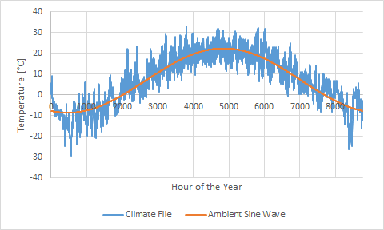
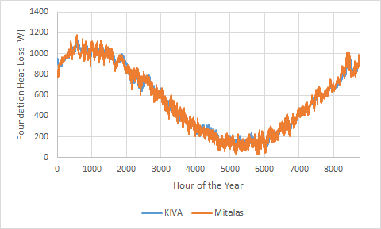

# Kiva-to-Mitalas

This script was developed to run annual foundation heat loss simulations using the stand-alone version of the simulation tool [KIVA](https://bigladdersoftware.com/projects/kiva/), and post process the output to determine model parameters required for the [Mitalas foundation heat loss model](https://nrc-publications.canada.ca/eng/view/ft/?id=2250b6cb-aee4-4ee0-a8a5-4cd24686945f).

## Methodology

### KIVA Overview

KIVA uses two-dimensional finite difference heat transfer calculations to determine foundation heat loss at a user-selected discrete time interval. KIVA can model several polygon footprint shapes with concave and convex corners; the only caveat is that all corners must be right angles. Heat losses in the corners are accounted for using the method from [Kruis and Krarti (2017)](https://www.tandfonline.com/doi/full/10.1080/19401493.2014.988753). More details can be found [here](https://bigladdersoftware.com/epx/docs/8-7/engineering-reference/ground-heat-transfer-calculations-using-kiva.html) and [here](https://bigladdersoftware.com/projects/kiva/). How to use KIVA and setup in input file is provided [here](https://bigladdersoftware.com/projects/kiva/).

### Mitalas Method Overview

The Mitalas model is built around the expression:

$$Q_{fdn}  \left(t\right) = Q_{fdn,ag} \left(t\right) + Q_{fdn,bg,avg}  + Q_{fdn,bg,var} \left(t\right)$$

where $Q_{fdn}  \left(t\right)$ is the total foundation heat loss \[W\] at hour $t$ of the year \[h\]. $Q_{fdn,ag}  \left(t\right)$ is the above-grade heat loss \[W\] at hour $t$ of the year, and is expressed as:

$$Q_{fdn,ag}  \left(t\right)= S_{ag}\cdot\left[ T_{bsmt} - T_{amb}\left(t\right)\right]$$

where $S_{ag}$ is the above-grade three-dimensional shape factor \[W/K\], $T_{bsmt}$ is the nominal air temperature in the basement \[W/K\], and $T_{amb}\left(t\right)\right]$ is the outdoor ambient drybulb temperature \[$^o$C\].

The two below-grade heat loss components are expressed as:

$$Q_{fdn,bg,avg}=S_{bg,avg}\cdot\left( T_{bsmt} - T_{g,avg}\right)$$
$$Q_{fdn,bg,var} \left(t\right)=S_{bg,var}\cdot T_{g,var}\cdot sin\left(\omega\cdot t + \phi - \frac{\pi}{2} - \theta\right)$$

where $S_{bg,avg}$ is the average below-grade three-dimensional shape factor \[W/K\], $T_{g,avg}$ is the average ambient temperature of the year \[$^o$C\], $S_{bg,var}$ is the below-grade shape factor amplitude \[W/K\], $T_{g,var}$ is the amplitude of the ambient temperature variation over the year, $\phi$ is the foundation thermal response phase shift \[rad\], $\theta$ is the phase lag of the ambient temperature \[rad\], and $\omega$ is the system frequency \[rad/h\]. Foundation heat loss follows an annual cycle, thus $\omega = \left(2\cdot\pi\right)\div 8760$.

Model inputs may be divided into two groups: climate and foundation. The climate inputs are $T_{amb}\left(t\right)$, $T_{g,avg}$, $T_{g,var}$, and $\theta$. The foundation inputs are $S_{ag}$, $T_{bsmt}$, $S_{bg,avg}$, $S_{bg,var}$, and $\phi$. If the soil thermophysical properties and water table depth is assumed to not change, the foundation inputs can be used with different climate inputs to estimate foundation heat loss in those different climates.

### Determining the Mitalas Model Inputs

For a given KIVA input file and climate file pair, the script first determines the Mitalas model climate inputs. KIVA uses EPW format climate files, and the script first extracts the hourly drybulb temperatures for the year. A Discrete Fourier Transform (DFT) is then performed on the real-number data to determine $T_{g,avg}$, $T_{g,var}$, and $\theta$, where $T_{g,var}$, and $\theta$ are the amplitude and phase shift of the first harmonic.

The KIVA input file is then opened by the script, and $S_{ag}$ is estimated using the one-dimensional U-value of the above-grade wall assembly multiplied by the above-grade wall area. The script then calls KIVA to get the hourly total foundation heat loss. The below-grade foundation heat loss is then estimated by subtracting $Q_{fdn,ag}$ from the total heat loss for each simulated timestep. The remaining Mitalas model foundation inputs are then determined by performing a DFT on the below-grade heat loss data.

## Setup

Python 3 will need to be installed. The script also imports the following packages:
- sys, getopt, os
- yaml
- math
- pandas
- numpy
- datetime

KIVA will also need to be installed. It can be found [here](https://bigladdersoftware.com/projects/kiva/).

Prior to running the script the path to the KIVA exe will need to be specified by editing the `KIVAtoMitalas.py` script. The path is specified in the variable `KIVAPATH` located at the top of the file.

## Usage

The python script may be invoked via the command line:

```
python KIVAtoMitalas.py --input <INPUT_YML> --climate <EPW_FILE> --output <OUTPUT>
```
where `<INPUT_YML>` is the KIVA foundation input file, `<EPW_FILE>` is the annual climate EPW file, and `<OUTPUT>` is the name of the report output file.

The user must first define a KIVA foundation input file. Instructions on how to do this are provided [here](https://kiva.readthedocs.io/en/stable/input-def/). The `Simulation Control` input group must have the following inputs:
- `Start Date: <YEAR>-Jan-1
- `End Date: <YEAR>-Dec-31
- `Timestep: 60 # [min]`

where `<YEAR>` corresponds to the year in the EPW file.\

***NOTE:*** Take care in selecting `Boundaries: Indoor Air Temperature`. This should match the nominal estimated air temperature of the basement. Testing has shown that $S_{bg,avg}$ is sensitive to the selection of this value.

## Example

An example is provided in the `example` folder. The foundation is \"L\" shaped, and an Ottawa, ON, [Canadian Weather Year for Energy Calculation](https://climate.weather.gc.ca/prods_servs/engineering_e.html) file is used as the climate. Script output is:

```
Created: 2022-07-01 11:16 AM
Input file: example\single_detached.yaml
Climate file: example\CAN_ON_OTTAWA-INTL-A_6106001_CWEC.epw
--------------------------
Climate Parameters
--------------------------
  Average temperature [oC]: 6.850901826484018
  Temperature amplitude [oC]: 15.510681075756045
  Temperature phase [rad]: 2.804320407869932

--------------------------
Foundation Parameters
--------------------------
  Above-grade shape factor, S_ag [W/K]: 8.997058283511011
  Below-grade average shape factor, S_bg,avg [W/K]: 34.41610921502191
  Below-grade amplitude shape factor, S_bg,var [W/K]: 20.394866997639518
  Below-grade phase [rad]: 5.154357268803739
```

Figure 1 plots the annual hourly drybulb temperature, and the temperature modelled as $T_{amb}=T_{g,avg}+T_{g,var}+\cdot sin\left(\omega\cdot t + \pi/2 + \theta\right)$.

| Figure 1. Annual Ambient Temperatures |
| :----------------------------------------------------------: |
|                       |

Figure 2 plots the hour heat loss of the total foundation reported by KIVA and using the Mitalas method which uses model inputs generated from this script.

| Figure 2. Annual Total Foundation Heat Loss |
| :----------------------------------------------------------: |
|                       |

The mean absolute error between the KIVA and Mitalas Model is 40 W.

## Limitations

The following is a list of the current limitations of the script (not limitations of KIVA):
- Only detached building foundations modelled in KIVA are supported by the script
- Any interior or exterior wall insulation is assumed to totally cover the above-grade wall section
- Only KIVA basements are currently supported by the script
- KIVA does not separate below and above-grade heat loss. The script uses an approximation based on above-grade wall one-dimensional U-value
